The True Story of a Story

#### [Yassine AZZOUT](https://github.com/92bondstreet)
#### Front-End Eng. Captain
#### Synthesio

---

  <!-- .element height="50%" width="50%" -->

---

any idea

---

* no context
* no instruction
* no author
* no reason

unclear

---

Most of assigned dev tickets

---

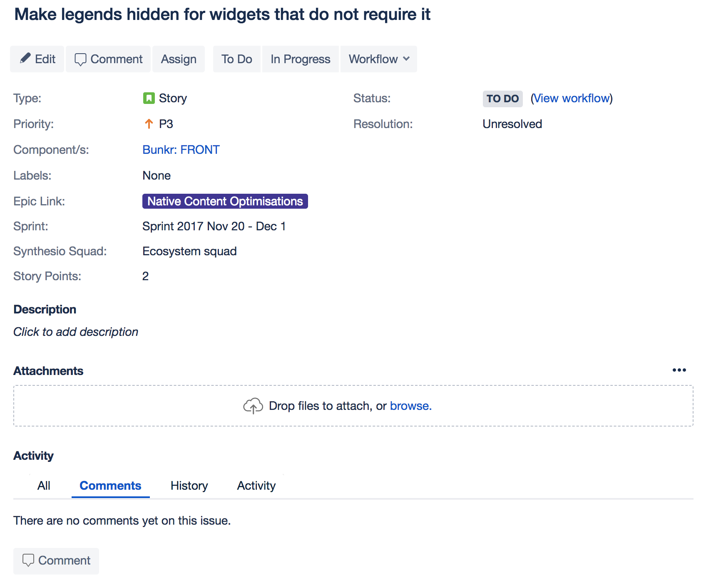  

---

  <!-- .element height="50%" width="50%" -->

---

After investigation

---

* need a call for a appointment
* but we call her later... not a priority now

---

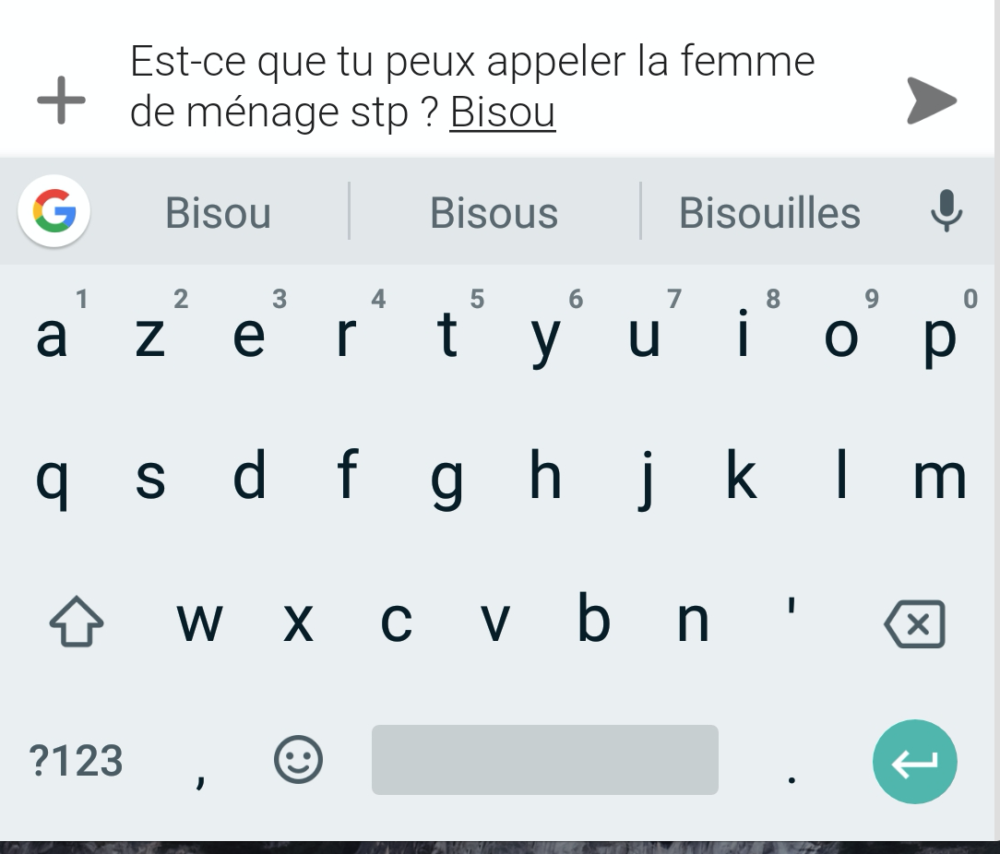

---

Please call her...

---

... but for what?

---

  <!-- .element height="50%" width="50%" -->

---

# New status

move from kitchen to desk

---

... but any idea if it's done

---

Most of assigned dev tickets

---

# EVERYTHING IS A STORY

---

Not only focusing on - Agile - User Story

---

A Story or a Narrative

---

* we need an author
* we need an audience
* we need a clear message
* we need chapter

---

* une situation initiale
* un élément déclencheur
* les actions
* un dénouement
* une situation finale

---

To understand your day-by-day is a Story

---

Not only to program a feature or solve an issue

---

Participate in writing the Story of your Product

---

# So ?

---

# Title

+

# Description

---

Loud and Clear

---

Like a Marc Levy best-seller

---

Large Audience

---

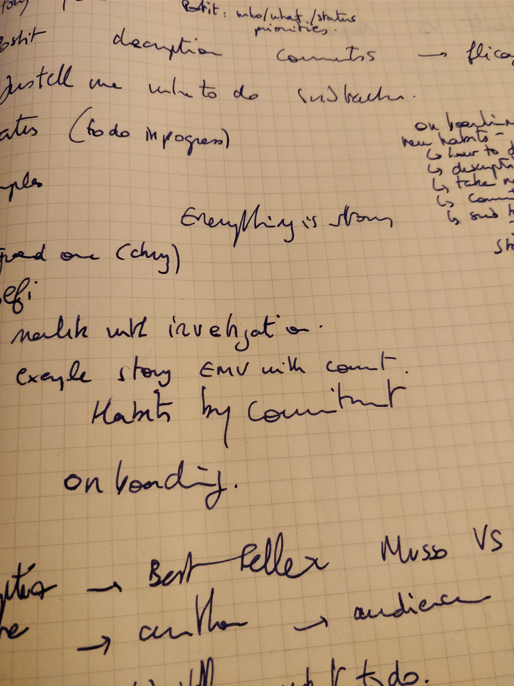  <!-- .element height="80%" width="80%" -->

---

Loud and Clear

---

1. Synopis
1. Objective
1. Just tell me what to do

---

Brief summary of the major points of a story

---

idea of the Future or desired Result

---

Compressing knowledge into directives

---

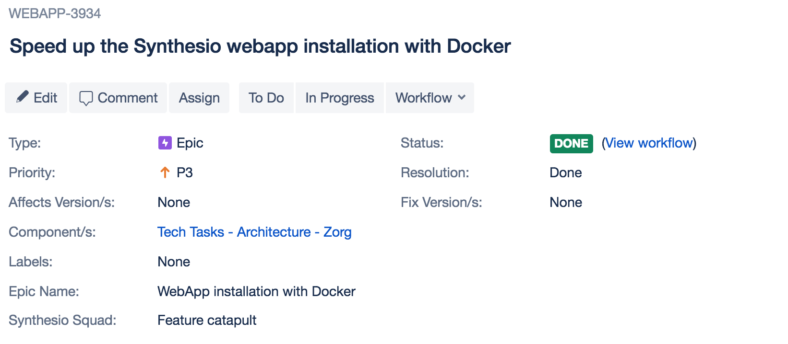

---

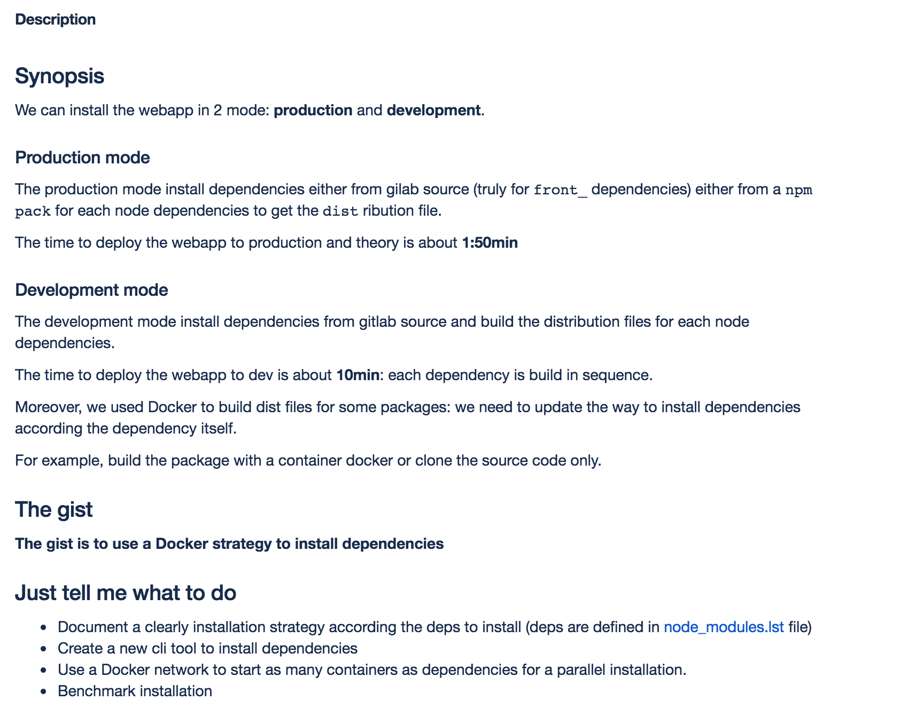 <!-- .element height="80%" width="80%" -->

---

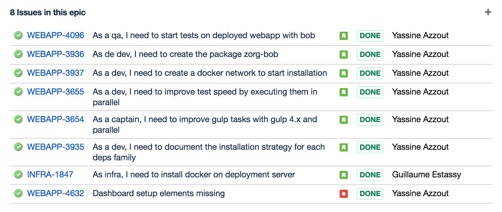

---

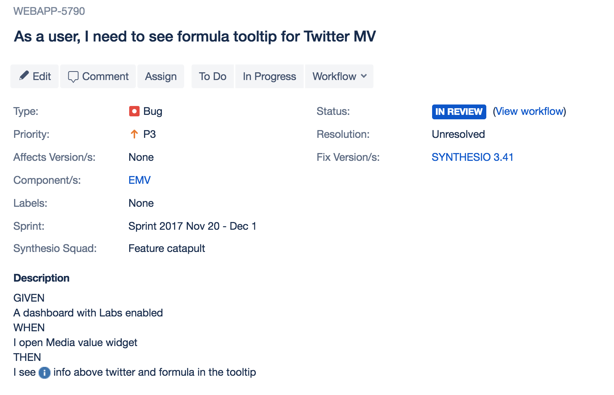

---

Create stories from the JTMWTD steps

---

Live and Become

---

Status

---

over commenting...

---

Even if only for you

---

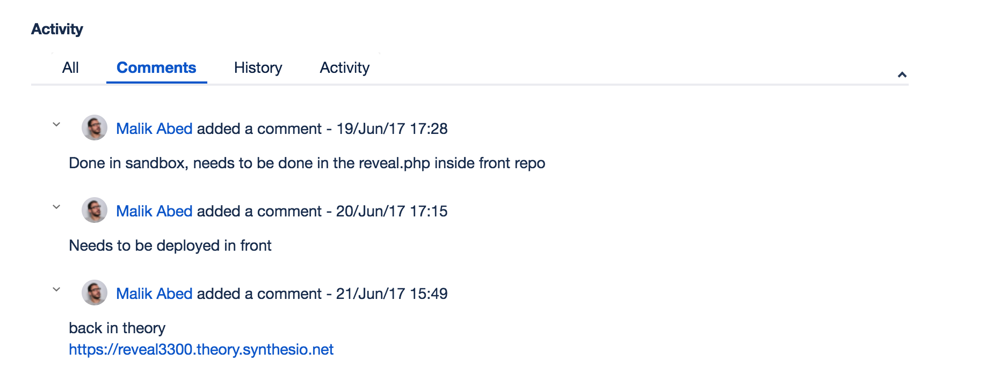

---

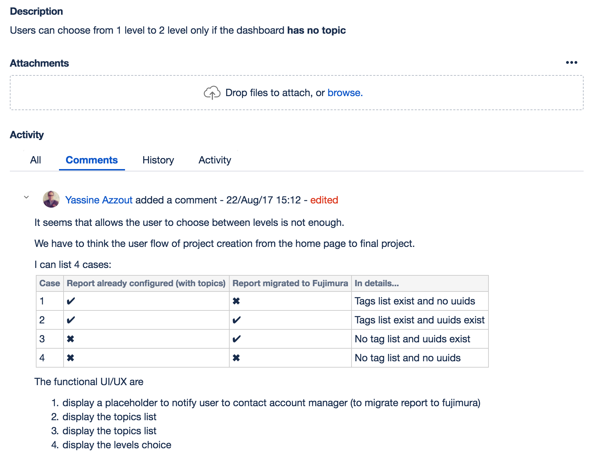 <!-- .element height="80%" width="80%" -->

---

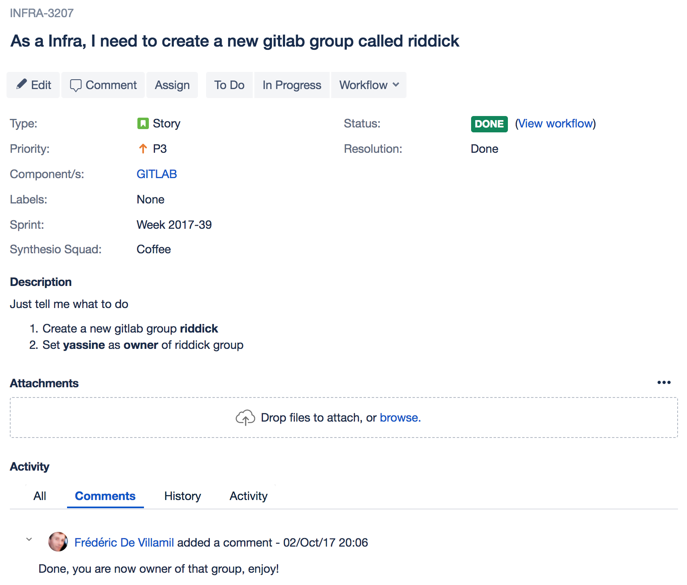 <!-- .element height="80%" width="80%" -->

---

And the management tracking?

---

Participate in writing the Story of your Product

---

How to adopt?

---

Habits by commitment

### 2, 5, 8 months... for new habit

---

Onboarding or later

---

Wait and See

---

Start only if the description is loud and clear

---

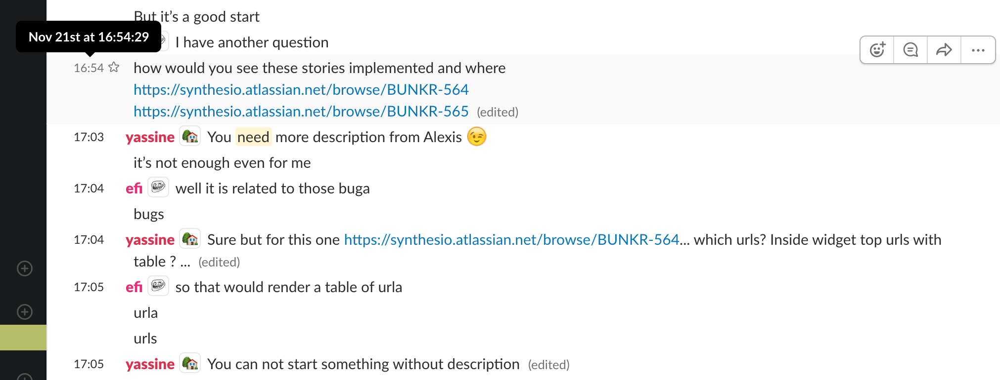

---

Take notes... WRITE !  

---

Comment... WRITE !

---

Split in stories... again and again

---

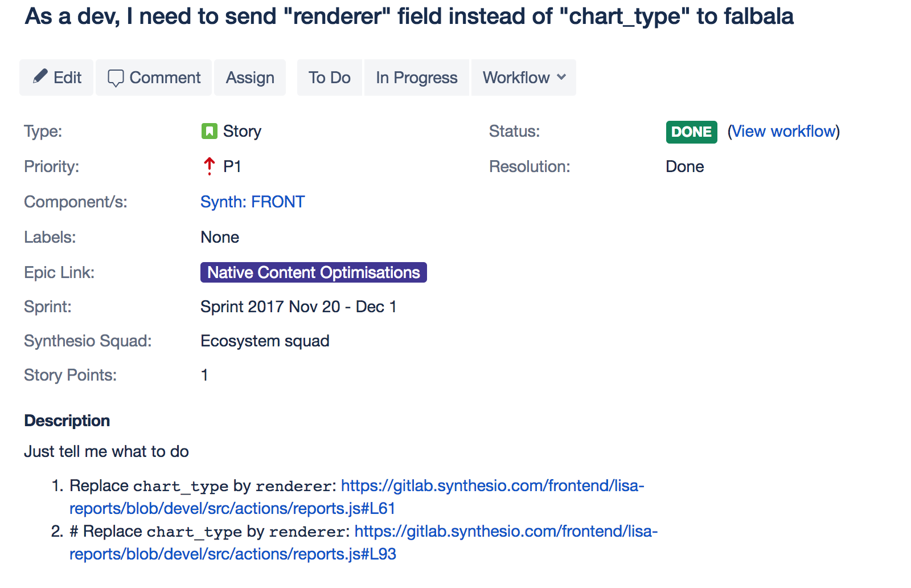

---

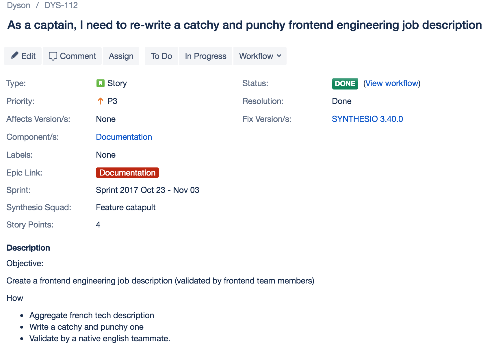

---

(not) The End
